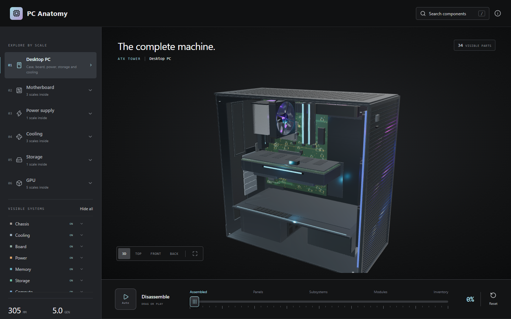

# PC Anatomy

PC Anatomy is an open-source 3D explorer that takes a desktop computer apart from the assembled ATX tower down to a single GPU streaming multiprocessor.



Every polygon is generated in TypeScript with three.js. There are no imported models, image textures, or other runtime asset files. The roughly 300 selectable components each carry a name, a description, an explanation of their purpose, specifications, and citations instead of stopping at a label.

## Scale tree

```text
Desktop PC
├── Motherboard
│   ├── Ryzen 9 9950X
│   └── Core Ultra 9 285K
├── Power supply
├── Cooling
│   ├── Case fan
│   ├── CPU cooler
│   └── Liquid cooling
├── Hard disk
└── RTX 5090
    └── GB202 processor
        └── Graphics processing cluster (GPC)
            └── Texture processing cluster (TPC)
                └── Streaming multiprocessor (SM)
```

The slider moves each scale from its assembled state to a laid-out inventory. Search can jump directly to a component at any depth, while breadcrumbs and the scale navigator move back through the machine.

## Quick start

PC Anatomy requires Node.js 22.13 or newer.

```bash
git clone https://github.com/Yoosseph/gpu_anatomy.git
cd gpu_anatomy
npm install
npm run dev
```

Vite prints the local development URL. To create and preview a production build:

```bash
npm run build
npm start
```

The project is entirely static. The production output is written to `dist/` and needs no backend.

## Project layout

| Path | Purpose |
| --- | --- |
| `index.html`, `app/main.tsx` | Vite entry point and React mount |
| `app/page.tsx` | Explorer interface, navigation, search, timeline, and detail panel |
| `app/viewer.tsx` | Canvas host and lazy scene loading |
| `app/workbench.css` | Desktop, responsive, and touch layout |
| `lib/scene.ts` | Renderer, camera, picking, dive animation, and explode interpolation |
| `lib/levels.ts` | Scale tree and per-scale presentation metadata |
| `lib/models.ts` | Builder registry and shared geometry tools |
| `lib/concepts/*.ts` | Written component catalogue, organized by subsystem |
| `lib/manifest.ts` | Catalogue composition, search, and explorer state helpers |
| `lib/*.ts` builder modules | Code-generated geometry for each physical or logical scale |
| `tests/*.test.ts` | Data integrity, layout, picking, and geometry-presence tests |
| `SOURCES.md` | Research and dimensional references |

## Adding a component

A component joins the written catalogue to selectable geometry through its concept ID.

1. Add the concept to the relevant file in `lib/concepts/`. Follow a neighboring entry and provide its unique `id`, scale, parent, category, representation type, explanation, specifications, accuracy note, and source IDs.
2. In that scale's builder, create the geometry and pass the same concept ID to the shared `add` or `instances` helper. The helper supplies selection identity, explode placement, inventory layout, and counting.
3. Add any new references to `lib/sources.ts` and document them in `SOURCES.md`.
4. If the concept lives in a new catalogue file, export its array and compose it into `lib/manifest.ts`.
5. Run the checks below. The tests reject anonymous geometry, duplicate concept IDs, broken parent links, and scales with nothing to render.

Do not introduce delayed reveal thresholds for assembled geometry. A component that exists in the assembled product should exist at slider position zero and move continuously as the product comes apart.

## Adding a scale

A new scale has five integration points:

1. Add its ID and definition to `lib/levels.ts`, including its parent, kind, concept, phases, and navigation text.
2. Implement its geometry builder and register that builder in `lib/models.ts`.
3. Add its written catalogue in `lib/concepts/`.
4. Put `open: '<new-level-id>'` on the concept in the parent scale that leads into it.
5. Export and compose the new concepts in `lib/manifest.ts`.

The scale tree drives navigation, breadcrumbs, lighting, and the disassembly timeline. Avoid adding a second hand-written route table. When a model is rebuilt, `lib/scene.ts` must also clear its cached `layoutSignature` so the new inventory is packed from its own pieces.

## Accuracy and sources

The machine follows published ATX dimensions where those dimensions are standardized. Three products are named and modeled as specific subjects: the GeForce RTX 5090, AMD Ryzen 9 9950X, and Intel Core Ultra 9 285K. The rest is an illustrative desktop build that explains representative construction and relationships rather than reproducing a particular bill of materials.

Processor and GPU floorplans are explanatory diagrams of documented logical architecture. They are not semiconductor mask layouts and do not claim exact transistor-level placement. See [SOURCES.md](SOURCES.md) for standards, product documentation, architecture references, and the scope of each source.

Product and company names are used nominatively to identify the hardware being described. PC Anatomy is not affiliated with or endorsed by NVIDIA, AMD, Intel, or any other named company.

## Contributing

Issues and focused pull requests are welcome. Keep written claims cited, preserve the distinction between physical models and logical diagrams, and run the full local checks before opening a change:

```bash
npm run check
npm run lint
npm test
npm run build
```

PC Anatomy is available under the [MIT License](LICENSE).
