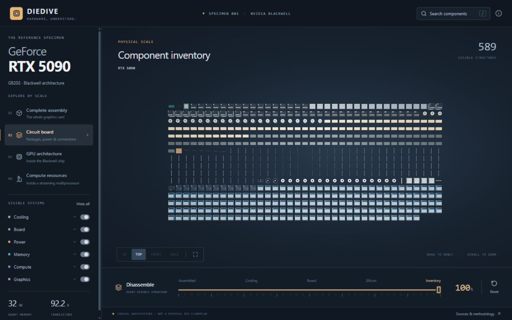

# PC Anatomy

PC Anatomy is an open-source 3D explorer that takes a desktop computer apart from the assembled ATX tower down to a single GPU streaming multiprocessor — and a DDR5 module down to its storage cells.

## [**Explore the live demo →**](https://pc-anatomy.com/)

Ideas worth building are collected on the [**roadmap and Kanban board →**](https://github.com/users/Yoosseph/projects/1). If you would like to contribute but have nothing particular in mind, start there: the Backlog column holds the suggestions and feedback waiting to be picked up.

Before changing any code, read [**ARCHITECTURE.md →**](ARCHITECTURE.md). It is the full technical picture of the project — the scale tree, where every module lives, the conventions behind the geometry, and the traps that are not obvious from reading the source. It is written to be read start to finish by whoever is doing the work, person or language model.

Every polygon is generated in TypeScript with three.js. There are no imported models, image textures, or other runtime asset files. The roughly 340 selectable components each carry a name, a description, an explanation of their purpose, specifications, and citations instead of stopping at a label.


Press **Auto** at the left end of the bottom bar to watch the machine take itself apart, or drag the timeline to move through the sequence by hand.

## Scale tree

```text
Desktop PC
├── Motherboard
│   ├── Ryzen 9 9950X
│   │   └── Ryzen I/O die
│   └── Core Ultra 9 285K
│       └── Core Ultra I/O tile
├── Memory
│   └── DDR5 module
│       └── DRAM package
│           └── DRAM banks
│               └── Bank
├── Power supply
│   ├── ASUS TUF Gaming 850W Gold · modular
│   └── ASUS TUF Gaming 750W Bronze · non-modular
├── Cooling
│   ├── Case fan
│   ├── CPU cooler
│   └── Liquid cooling
├── SATA SSD
└── GPU
    ├── RTX 5090
    │   └── GB202 processor
    │       └── Graphics processing cluster (GPC)
    │           └── Texture processing cluster (TPC)
    │               └── Streaming multiprocessor (SM)
    ├── Radeon RX 9070 XT
    │   └── Navi 48 processor
    │       └── Shader engine
    │           └── Workgroup processor (WGP)
    │               └── Compute unit (CU)
    └── Arc B580
        └── BMG-G21 processor
            └── Render slice
                └── Xe-core
                    └── Xe vector engine (XVE)
```

The slider moves each scale from its assembled state to a laid-out inventory. Search can jump directly to a component at any depth, while breadcrumbs and the scale navigator move back through the machine.


Descending into a part rebuilds it at its own scale with its own timeline, so the graphics card that was installed in the tower comes apart into its shroud, fans, fin banks, heat pipes, vapor chamber, board and backplate.


## The interface

The rail on the left carries the scale tree and per-system visibility. The GPU menu holds three cards, the RTX 5090, Radeon RX 9070 XT and Arc B580, each with its own dropdown of scales. The Power supply menu lists two TUF Gaming units directly: an 850W Gold with modular sockets and a 750W Bronze with fixed cables. The bar along the bottom is the disassembly timeline, with the **Auto** key at its left-hand end, the named phases above the slider, and a reset on the right. Left-click an explorable component to open it; right-click to inspect it and use the detail, hide, isolate and focus controls. Hidden components remain available from the stage tracker until they are restored, the scale changes, or the explorer is reset. The **Airflow** switch beside the camera views draws the path the air takes, cool where it enters and warm where it leaves, and it fades as soon as the disassembly slider moves. It starts on wherever there are fans except on the complete machine, where the case is closed and the switch is there to turn it on. The corner expand control toggles browser fullscreen.

| Workbench                                                                                                              | On a phone                                                                                                                                               |
| ---------------------------------------------------------------------------------------------------------------------- | -------------------------------------------------------------------------------------------------------------------------------------------------------- |
|  |  |



## Quick start

PC Anatomy requires Node.js 22.13 or newer.

```bash
git clone https://github.com/Yoosseph/pc-anatomy.git
cd pc-anatomy
npm install
npm run dev
```

Vite prints the local development URL. To create and preview a production build:

```bash
npm run build
npm start
```

The project is entirely static. The production output is written to `dist/` and needs no backend.

## Search appearance

The public URL is `https://pc-anatomy.com/`. The HTML entry includes a canonical URL, descriptive title, social preview metadata, and WebSite / WebApplication structured data. `public/guide/index.html` is a readable hardware guide that works without JavaScript and links back to the explorer.

Deploy the entire `dist/` directory, including `guide/`, `robots.txt`, `sitemap.xml`, and the icon files. Serve `/guide/` from its own `index.html` before applying any single-page-app fallback. If the hostname changes, update the canonical and social URLs in both HTML pages, the structured data, and the sitemap and robots files together.

After deployment, submit `https://pc-anatomy.com/sitemap.xml` in Google Search Console and request indexing of the homepage and guide. Indexing, favicon display, and ranking are decided by Google and may take time after a recrawl. Do not add fabricated ratings or keyword stuffing.

The browser and search icons are derived from `public/favicon.svg`. Run `node scripts/generate-icons.mjs` to regenerate the PNG and multi-resolution ICO variants (uses Playwright and Microsoft Edge). `public/pc-assembled.png` is a capture of the actual model; `public/social-preview.png` is its sharing card.

## Working on the code

The technical detail lives in **[ARCHITECTURE.md](ARCHITECTURE.md)**, next to this file. It covers how to run and check the project, the full scale tree, where every module lives and what it answers for, the interface a geometry builder is handed, the conventions that keep the models consistent, how to add a component or a whole new scale, the sourcing rules, and what the tests do and do not verify.

Read it before the first edit. It is kept current with the code, and a change that moves a module or settles a decision should update it in the same commit.

## Accuracy and sources

The machine follows published ATX dimensions where those dimensions are standardized. Seven products are named and modeled as specific subjects: the GeForce RTX 5090, AMD Radeon RX 9070 XT, Intel Arc B580, AMD Ryzen 9 9950X, Intel Core Ultra 9 285K, ASUS TUF Gaming 850W Gold and ASUS TUF Gaming 750W Bronze. The RTX 5090 is the card installed in the tower; the Radeon (after the Sapphire NITRO+) and the Arc (Intel Limited Edition) are complete alternative cards opened from the GPU menu. The modular PSU is the one installed in the tower; the fixed-cable model opens from the Power supply menu. The rest is an illustrative desktop build that explains representative construction and relationships rather than reproducing a particular bill of materials.

Processor and GPU floorplans are explanatory diagrams of documented logical architecture. They are not semiconductor mask layouts and do not claim exact transistor-level placement. See [SOURCES.md](SOURCES.md) for standards, product documentation, architecture references, and the scope of each source.

The PSU exteriors follow published dimensions and visible product features; their internal boards explain the conversion chain and are not service diagrams of ASUS circuitry. Product and company names are used nominatively to identify the hardware being described. PC Anatomy is not affiliated with or endorsed by NVIDIA, AMD, Intel, ASUS, or any other named company.

## Contributing

Issues and focused pull requests are welcome, and the [roadmap and Kanban board](https://github.com/users/Yoosseph/projects/1) lists what is open. Start with [ARCHITECTURE.md](ARCHITECTURE.md), keep written claims cited, preserve the distinction between physical models and logical diagrams, and run the full local checks before opening a change:

```bash
npm run check
npm run lint
npm test
npm run build
```

GitHub Actions runs these checks on every push and pull request using Node.js 22.

## AI disclaimer

AI-assisted tools were used selectively during development for coding support, debugging, iteration, and documentation. The project’s architecture, technical direction, design, integration, and validation were developed and maintained by the project maintainer.

PC Anatomy is available under the [MIT License](LICENSE).
